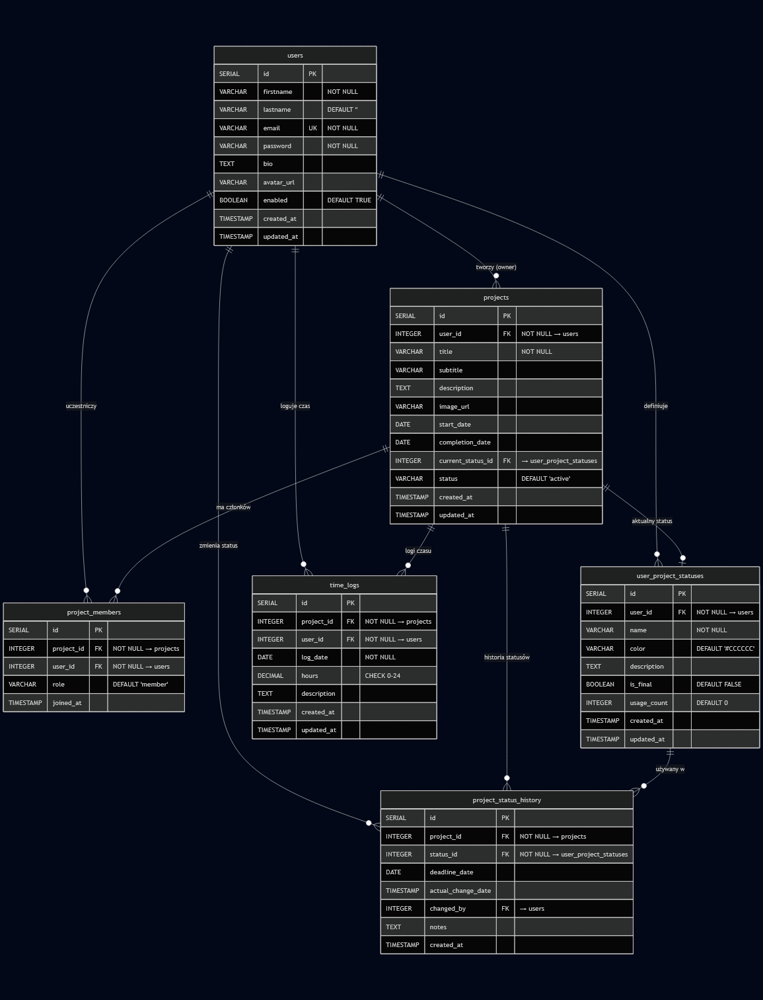

# 🗂️ Project Time Tracker

System zarządzania projektami i śledzenia czasu pracy. Aplikacja webowa napisana w PHP z bazą PostgreSQL, uruchamiana w kontenerach Docker.

---

## ✨ Funkcjonalności

### Dashboard
- Przegląd wszystkich projektów użytkownika
- Wyświetlanie najbliższych deadline'ów z licznikiem dni
- Szybkie logowanie godzin pracy na dany dzień
- Podgląd dzisiejszych wpisów z podsumowaniem

### Zarządzanie projektami
- Tworzenie nowych projektów z tytułem, opisem i obrazkiem
- Edycja szczegółów projektu (tytuł, podtytuł, opis, daty)
- Elastyczny system statusów definiowanych przez użytkownika
- Pełna historia zmian statusów z notatkami
- Przypisywanie deadline'ów do poszczególnych etapów

### Śledzenie czasu
- Logowanie przepracowanych godzin per projekt/dzień
- Automatyczne sumowanie godzin (max 24h/dzień)
- Jeden wpis dziennie per projekt (aktualizacja zastępuje poprzedni)
- Historia wszystkich wpisów z opisami

### Raporty miesięczne
- Wybór roku i miesiąca do raportu
- Zestawienie godzin per projekt
- Automatyczne obliczanie sum

### System użytkowników
- Rejestracja i logowanie
- Hashowanie haseł (bcrypt)
- Sesje PHP
- Automatyczne tworzenie domyślnego projektu i statusów przy rejestracji

---

## 🎯 Use Cases

**Freelancer / Konsultant**  
Śledzenie czasu spędzonego na projektach dla różnych klientów. Generowanie miesięcznych raportów do fakturowania.

**Inżynier / Projektant**  
Zarządzanie etapami projektu z własnymi statusami (np. "Projekt wstępny", "Dokumentacja", "Realizacja", "Odbiór"). Monitorowanie deadline'ów.

**Zespół projektowy**  
Współdzielenie projektów między członkami zespołu. Śledzenie kto ile godzin przepracował.

**Menedżer**  
Przegląd postępów projektów, analiza wykorzystania czasu, planowanie zasobów.

---

## 🏗️ Architektura

### Wzorzec MVC + Repository

```
┌─────────────────────────────────────────────────────────────┐
│                        FRONTEND                             │
│  ┌─────────┐  ┌─────────┐  ┌─────────┐  ┌─────────────────┐ │
│  │ Login   │  │Dashboard│  │Projects │  │ Project Manage  │ │
│  │ Register│  │         │  │ List    │  │ Report          │ │
│  └─────────┘  └─────────┘  └─────────┘  └─────────────────┘ │
└────────────────────────┬────────────────────────────────────┘
                         │ AJAX / Form POST
┌────────────────────────▼────────────────────────────────────┐
│                       ROUTING                               │
│                     (Routing.php)                           │
└────────────────────────┬────────────────────────────────────┘
                         │
┌────────────────────────▼────────────────────────────────────┐
│                     CONTROLLERS                             │
│  ┌──────────────┐  ┌──────────────┐  ┌──────────────────┐   │
│  │ Security     │  │ Dashboard    │  │ Project          │   │
│  │ Controller   │  │ Controller   │  │ Controller       │   │
│  └──────────────┘  └──────────────┘  └──────────────────┘   │
│                    ┌──────────────┐                         │
│                    │ Report       │                         │
│                    │ Controller   │                         │
│                    └──────────────┘                         │
└────────────────────────┬────────────────────────────────────┘
                         │
┌────────────────────────▼────────────────────────────────────┐
│                    REPOSITORIES                             │
│  ┌────────────┐ ┌────────────┐ ┌────────────────────────┐   │
│  │ User       │ │ Project    │ │ ProjectStatus          │   │
│  │ Repository │ │ Repository │ │ Repository             │   │
│  └────────────┘ └────────────┘ └────────────────────────┘   │
│  ┌────────────┐ ┌────────────────────────────────────────┐  │
│  │ TimeLog    │ │ StatusHistory                          │  │
│  │ Repository │ │ Repository                             │  │
│  └────────────┘ └────────────────────────────────────────┘  │
└────────────────────────┬────────────────────────────────────┘
                         │ PDO
┌────────────────────────▼────────────────────────────────────┐
│                     PostgreSQL                              │
│                    (6 tabel + 4 widoki)                     │
└─────────────────────────────────────────────────────────────┘
```

### Diagram ERD



### Struktura katalogów

```
├── docker/
│   ├── db/
│   │   ├── Dockerfile
│   │   ├── init.sql          # Inicjalizacja bazy
│   │   └── schema.sql        # Pełny schemat
│   ├── nginx/
│   │   ├── Dockerfile
│   │   └── nginx.conf
│   └── php/
│       └── Dockerfile
├── public/
│   ├── scripts/              # JavaScript (AJAX)
│   ├── styles/               # CSS (mobile-first)
│   └── views/                # Szablony HTML/PHP
├── src/
│   ├── controllers/          # Logika aplikacji
│   ├── database/             # Połączenie z bazą
│   └── repository/           # Warstwa dostępu do danych
├── config.php                # Konfiguracja bazy
├── docker-compose.yaml
├── index.php                 # Entry point
└── Routing.php               # Router URL
```

---

## 🛠️ Stack technologiczny

| Warstwa | Technologia |
|---------|-------------|
| **Backend** | PHP 8.3 (FPM Alpine) |
| **Baza danych** | PostgreSQL |
| **Serwer HTTP** | Nginx 1.17 |
| **Konteneryzacja** | Docker + Docker Compose |
| **Frontend** | Vanilla JS, CSS Grid/Flexbox |
| **Styl** | Mobile-first responsive design |

---

## 🚀 Uruchomienie

### Wymagania
- Docker
- Docker Compose

### Instalacja

```bash
# Klonowanie repozytorium
git clone https://github.com/your-username/project-time-tracker.git
cd project-time-tracker

# Uruchomienie kontenerów
docker-compose up -d

# Aplikacja dostępna pod adresem:
# http://localhost:8080
```

### Dane testowe

Po uruchomieniu dostępne jest konto testowe:

| Email | Hasło |
|-------|-------|
| `jan.kowalski@example.com` | `test123` |

### Porty

| Usługa | Port |
|--------|------|
| Aplikacja (Nginx) | `8080` |
| PostgreSQL | `5433` |
| pgAdmin | `5050` |

### pgAdmin

Dostęp do panelu administracyjnego bazy:
- URL: `http://localhost:5050`
- Email: `admin@example.com`
- Hasło: `admin`

---

## 📊 Schemat bazy danych

### Tabele

| Tabela | Opis |
|--------|------|
| `users` | Użytkownicy systemu |
| `projects` | Projekty z metadanymi |
| `project_members` | Członkowie projektów (N:M) |
| `user_project_statuses` | Własne statusy użytkownika |
| `project_status_history` | Historia zmian statusów |
| `time_logs` | Logowanie przepracowanych godzin |

### Widoki pomocnicze

| Widok | Opis |
|-------|------|
| `user_status_suggestions` | Najczęściej używane statusy |
| `project_current_status` | Aktualny status projektu |
| `project_total_hours` | Suma godzin per projekt |
| `user_project_hours` | Godziny per użytkownik/projekt |

### Triggery

- Automatyczna aktualizacja `updated_at`
- Inkrementacja licznika użycia statusów
- Aktualizacja `current_status_id` przy zmianie statusu
- Dodanie właściciela jako członka projektu
- Tworzenie domyślnych statusów i projektu dla nowego użytkownika

---

## 📱 Responsywność

Aplikacja zaprojektowana mobile-first z breakpointami:

| Breakpoint | Urządzenie |
|------------|------------|
| < 768px | Mobile |
| 768px - 1024px | Tablet |
| 1024px - 1440px | Desktop |
| > 1440px | Large Desktop |

---

## 🔒 Bezpieczeństwo

- Hashowanie haseł: `password_hash()` z `PASSWORD_BCRYPT`
- Prepared statements (PDO) - ochrona przed SQL Injection
- `htmlspecialchars()` - ochrona przed XSS
- Weryfikacja uprawnień do zasobów
- Sesje PHP z regeneracją ID

---

## 📝 API Endpoints

### Autentykacja
| Metoda | Endpoint | Opis |
|--------|----------|------|
| GET/POST | `/login` | Logowanie |
| GET/POST | `/register` | Rejestracja |
| GET | `/logout` | Wylogowanie |

### Dashboard
| Metoda | Endpoint | Opis |
|--------|----------|------|
| GET | `/dashboard/{user_id}` | Strona główna |
| POST | `/dashboard/log-hours` | Logowanie godzin (AJAX) |

### Projekty
| Metoda | Endpoint | Opis |
|--------|----------|------|
| GET | `/projects/{user_id}` | Lista projektów |
| POST | `/projects/create` | Tworzenie projektu |
| GET | `/projects/manage/{id}` | Zarządzanie projektem |
| POST | `/projects/update/{id}` | Aktualizacja projektu |
| POST | `/projects/update-status/{id}` | Zmiana statusu |
| POST | `/projects/create-status` | Nowy status |

### Raporty
| Metoda | Endpoint | Opis |
|--------|----------|------|
| GET | `/report/{user_id}` | Strona raportów |
| GET | `/report/data?year=X&month=Y` | Dane raportu (AJAX) |

---

## 🌍 Lokalizacja

Aplikacja w pełni zlokalizowana w języku polskim:
- Interfejs użytkownika
- Komunikaty błędów i sukcesu
- Formatowanie liczb (przecinek jako separator dziesiętny)
- Formatowanie dat (DD.MM.YYYY)

---

## 📄 Licencja

MIT License

---

## 👨‍💻 Autor

**krx2**

---

*Built with ❤️ and ☕*
